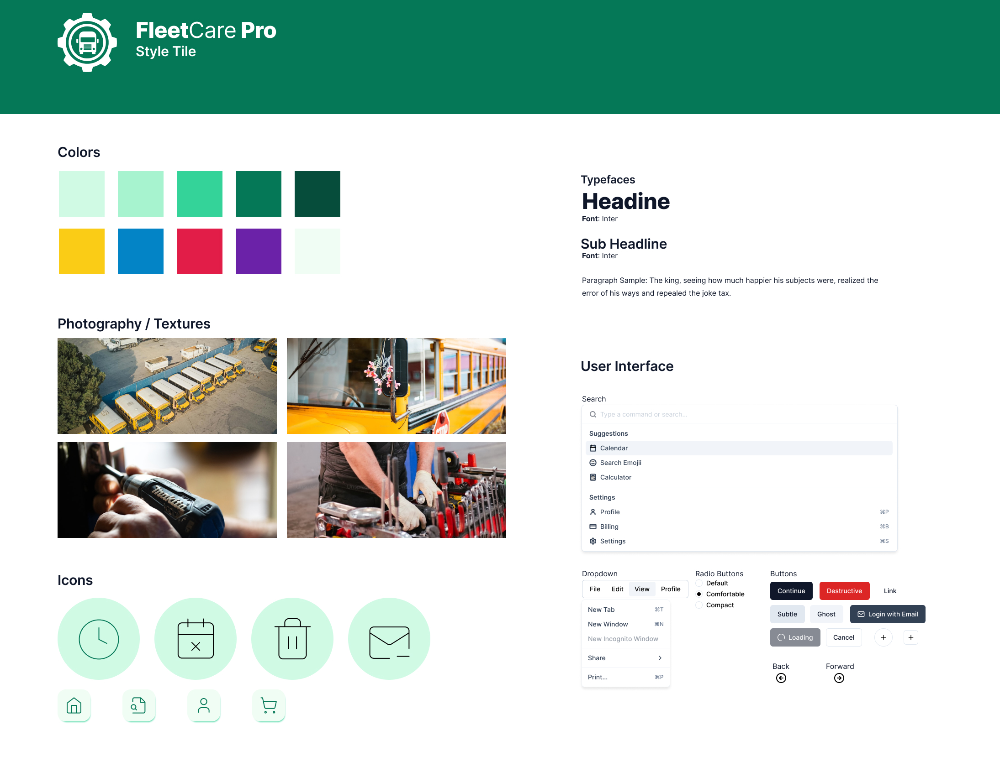

# Marketing Plan for FleetCarePro

 
Prepared by: Level Lawrence
 
Date: 05/11/2025
 

Branding: 

---

### 1. Target Audience

**Primary Audience:**

- **School Districts:** Transportation directors and fleet managers overseeing school bus maintenance.
- **Municipal Governments:** Fleet supervisors managing public service vehicles.
- **State Agencies:** Transportation departments handling compliance and large-scale fleet operations.

**Why FleetCarePro Appeals to Them:**

- **Cost Efficiency:** Reduces maintenance costs through predictive analytics.
- **Compliance:** Automates tracking of state/federal regulations.
- **User-Friendly Design:** Mobile-first interface for field technicians and managers.

---

### 2. Marketing Methods

#### Online Strategies

1. **SEO & Content Marketing**

   - **Keywords:** “school bus maintenance software,” “government fleet compliance tools.”
   - **Blog Posts:** _“5 Strategies to Cut Fleet Downtime”_ (targeting pain points if time permits).

2. **LinkedIn Ads**

   - **Targeting:** “Fleet Manager” job titles, public sector employees.
   - **Ad Copy:** _“All your maint. needs in onces place.”_

3. **Webinars**
   - **Topic:** _“Navigating 2025 EV Fleet Regulations.”_
   - **Promotion:** Partner with NAFA (National Association of Fleet Administrators).
   - **Cost:** $500/webinar (Zoom license, promotional graphics).

#### **Offline Strategies**

1. **Industry Conferences**

   - **Event:** TransporTech 2025 (booth + demo sessions).
   - **Cost:** $5,000 (registration, travel, materials).

2. **Direct Mail Campaigns**

   - **Materials:** Customized ROI calculators mailed to 500 fleet managers.
   - **Cost:** $2,000 (design, printing, postage).

3. **Local Government Workshops**
   - **Action:** Host free workshops on “Cost-Saving Fleet Maintenance” in 10 cities.
   - **Cost:** $1,000/event (venue, handouts).

#### **Out-of-the-Box Ideas**

- **Fleet Health Scorecard:** Free audit tool (gated content) to generate leads.
- **Referral Program:** $500 credit for successful referrals.

---

### **3. Measuring Success**

| **Metric**        | **Tool**    | **Target**     |
| ----------------- | ----------- | -------------- |
| Demo Requests     | HubSpot CRM | 50/month       |
| Social Engagement | Hootsuite   | 15% increase   |
| Pilot Conversions | Salesforce  | 20% conversion |

---

### **4. Conclusion**

This plan combines **targeted digital outreach** (SEO, LinkedIn) with **high-impact offline tactics** (meetings with school officials and workshops) to position FleetCarePro as the go-to solution for public-sector fleets. By focusing on compliance, cost savings, and user experience, we aim to secure 100+ pilot signups within six months.

---

### **References**

- Team, F. (2023a, October 27). 2023 fleet management trends - fleet team. Fleet Team - Optimized Fleets. Lower TCO. [fleetteam.com](https://fleetteam.com/2023-fleet-management-trends/)
- NAFA. (2024). _Public Sector Fleet Compliance Guidelines_. Retrieved from [www.nafa.org](https://www.nafa.org)
